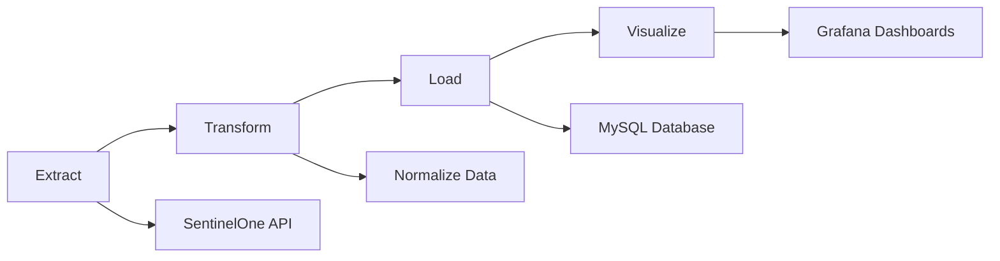

# 🧠 Infrastructure Vulnerability Dashboard

## SentinelOne Vulnerability Automation

---

## Executive Summary

This project delivers a **fully automated system** for collecting, processing, and visualizing endpoint vulnerability data retrieved from the SentinelOne API. The purpose is to centralize vulnerability intelligence, enhance organizational visibility into security exposure, and accelerate remediation through real-time analytics and dashboards.

### Key Benefits

- ✅ **Automated data collection** from SentinelOne API
- ✅ **Real-time vulnerability insights** via Grafana dashboards
- ✅ **Centralized security intelligence** for faster decision-making
- ✅ **Risk prioritization** based on CVSS severity scoring

The solution integrates **Python**, **MySQL**, **Node-RED**, and **Grafana** to create an automated vulnerability management pipeline — from ingestion to visualization — enabling the security team to prioritize and mitigate risks efficiently.

---

## Project Overview

| Category | Details |
|----------|---------|
| **Project Name** | Infrastructure Vulnerability Dashboard |
| **Objective** | Automate vulnerability data collection and visualization for enterprise endpoints |
| **Scope** | Data ingestion from SentinelOne → MySQL storage → Grafana visualization |
| **Exclusions** | Vulnerability patching or endpoint configuration management |
| **Primary Stakeholders** | Security Operations, Threat Intelligence, IT Infrastructure |
| **Status** | ✅ In production / continuous improvement |

---

## Architecture

### System Components

The system is composed of the following layers:

#### 🔹 Data Ingestion Layer

- Python scripts interact with the SentinelOne API to fetch endpoint and vulnerability data
- Scheduled automation via Node-RED ensures periodic execution (daily or weekly)

#### 🔹 Storage Layer

- Data is normalized and stored in MySQL for structured querying
- Schema includes vulnerability metadata, severity, affected endpoints, timestamps, and manufacturer details

#### 🔹 Visualization Layer

- Grafana dashboards consume MySQL data sources to provide real-time visualizations
- Includes severity breakdowns, top vulnerable applications, and monthly trends
- Supports threshold-based alerting for critical vulnerabilities

#### 🔹 Automation & Orchestration

- Node-RED handles workflow orchestration and scheduling
- Docker ensures environment consistency and reproducibility

### Architecture Diagram

```
┌─────────────────┐
│  SentinelOne    │
│      API        │
└────────┬────────┘
         │
         ▼
┌─────────────────┐      ┌─────────────────┐
│   Python ETL    │─────▶│     MySQL       │
│    Scripts      │      │    Database     │
└────────┬────────┘      └────────┬────────┘
         │                        │
         ▼                        ▼
┌─────────────────┐      ┌─────────────────┐
│   Node-RED      │      │    Grafana      │
│   Scheduler     │      │   Dashboards    │
└─────────────────┘      └────────┬────────┘
                                  │
                                  ▼
                         ┌─────────────────┐
                         │ Alerts/Reports  │
                         └─────────────────┘
```

---

## Security Design

### 🔐 Authentication and Access Control

- **API Authentication**: Secure SentinelOne API token (JWT-based)
- **Grafana Access**: Role-Based Access Control (RBAC) with viewer/editor/admin segregation
- **Database Security**: Restricted MySQL user privileges (read-only for visualization layer)

### 🛡️ Data Protection

| Layer | Protection Method |
|-------|------------------|
| **In Transit** | HTTPS and TLS 1.2+ enforced for all API communications |
| **At Rest** | Database encryption via MySQL native mechanisms |
| **Secrets Management** | Credentials managed via environment variables (.env) and Docker secrets |

### 📝 Logging and Auditability

- All ingestion operations are logged (timestamp, API response, success/failure)
- Grafana and Node-RED logs are centralized for review
- Access logs maintained for API keys and dashboard usage

### ✓ Compliance Alignment

- Aligned with **NIST 800-53**, **CIS Controls**, and **ISO 27001** principles
- Implements least privilege and separation of duties
- Supports data retention and audit trail policies

---

## Data Pipeline

### Data Sources

#### SentinelOne Management API

- `/agents` → Endpoint data
- `/vulnerabilities` → CVE, CVSS, product, vendor, severity

### Processing Flow



**Pipeline Steps:**

1. **Extract** vulnerability data via authenticated API call
2. **Transform** into structured format (normalize OS, vendor, and severity)
3. **Load** into MySQL database using Python (ETL job)
4. **Visualize** with Grafana queries for live insights

### Data Normalization Rules

#### Severity Mapping

| CVSS Score | Severity Level |
|------------|----------------|
| ≥ 9.0 | 🔴 **Critical** |
| 7.0–8.9 | 🟠 **High** |
| 4.0–6.9 | 🟡 **Medium** |
| < 4.0 | 🟢 **Low** |

#### Data Quality Rules

- **Duplicate Handling**: Unique constraint based on `(CVE_ID, endpoint_id)`
- **Timestamp Tracking**: Each entry includes `last_seen` and `updated_at`

---

## Dashboard Visualization

### Grafana Panels Overview

The dashboard provides **OS-based segmentation** and **severity distribution** across three main platforms:

#### 🍎 MacOS Section

- Weekly and monthly total vulnerabilities (Critical / High / Medium / Low)
- Top 10 vulnerable applications by severity
- Trends and severity heatmaps

#### 🪟 Windows Section

- Vulnerability counts segmented by severity
- Manufacturer correlation (e.g., Microsoft, Fortinet, Mozilla)
- Threshold-based alerts (e.g., CVSS > 8)

#### 🐧 Linux Section

- Kernel-related vulnerability insights
- Distribution across packages (Ubuntu, Debian, SUSE)
- Monthly trends and remediation priorities


### Key Performance Indicators (KPIs)

| Metric | Description |
|--------|-------------|
| **Critical Vulnerabilities** | Count of CVEs ≥ 9.0 |
| **Mean Time to Detect (MTTD)** | Time between discovery and ingestion |
| **Endpoint Coverage** | Percentage of devices reporting |
| **Remediation Progress** | Reduction of criticals month-over-month |

---

## Deployment

### System Requirements

| Component | Version |
|-----------|---------|
| Python | 3.10+ |
| MySQL | 8.0+ |
| Grafana | 10+ |
| Node-RED | Latest |
| Docker / Docker Compose | Latest |

### Quick Start

```bash
# Clone the repository
git clone https://github.com/CHDevSec/SentinelOne-Vulnerability-Automation.git

# Navigate to project directory
cd SentinelOne-Vulnerability-Automation

# Start all services with Docker Compose
docker-compose up -d
```

### Configuration Files

| File | Purpose |
|------|---------|
| `.env` | SentinelOne API Token, DB credentials, refresh interval |
| `config.json` | Endpoint URLs, Grafana datasource parameters |
| `grafana-dashboard.json` | Panel templates |

---

## Testing & Validation

### Test Categories

#### ✅ Unit Tests
- Python ETL modules and MySQL insertion logic

#### ✅ Integration Tests
- API connectivity and response validation

#### ✅ Security Tests
- API token validation
- SQL injection prevention
- Access control validation

### Testing Tools

- **pytest** - Unit and integration testing
- **OWASP ZAP** - API fuzzing
- **Trivy / Bandit** - Static code analysis
- **Grafana Alert Testing** - Dashboard validation

---

## Observability

### Logging Strategy

| Component | Log Type | Storage / Review |
|-----------|----------|------------------|
| **Python ETL** | API responses, errors | Local + Syslog |
| **Node-RED** | Flow execution logs | Node-RED UI |
| **Grafana** | Access + query logs | Grafana Server |
| **Database** | Connection + error logs | MySQL log files |

### Monitoring Metrics

- ✓ Ingestion success rate
- ✓ Dashboard query latency
- ✓ Endpoint coverage ratio

---

## Maintenance

### Continuous Improvement

| Area | Implementation |
|------|----------------|
| **CI/CD Pipeline** | Automated via GitHub Actions |
| **Versioning** | Semantic Versioning (v1.0.0 → v1.1.0) |
| **Backup** | Daily MySQL dump and Grafana export |
| **Monitoring** | Health checks via Node-RED heartbeat flow |

### Enhancement Roadmap

- [ ] Integration with Elastic Stack for SIEM correlation
- [ ] Machine learning risk scoring
- [ ] Email/Slack alert automation

---

## Risk Management

| Risk | Impact | Likelihood | Mitigation |
|------|--------|-----------|------------|
| SentinelOne API downtime | Medium | Low | Caching + retry logic |
| Data inconsistency | High | Medium | Integrity constraints in MySQL |
| Unauthorized access | High | Low | RBAC + token rotation |
| Performance degradation | Medium | Medium | Query optimization + indexing |
| Configuration errors | Low | Medium | Docker environment templates |

---

## Backlog

| ID | Task | Priority | Status |
|----|------|----------|--------|
| 001 | Add Elastic SIEM integration | 🔴 High | 🔄 In Progress |
| 002 | Develop risk scoring model | 🟡 Medium | 📋 Planned |
| 003 | Add Slack notification on critical threshold | 🟡 Medium | ✅ Done |
| 004 | Optimize MySQL schema indexing | 🔴 High | ✅ Done |
| 005 | Implement anomaly detection (Node-RED AI node) | 🟢 Low | 📋 Planned |

---

## References

### Documentation

- [SentinelOne API Documentation](https://developer.sentinelone.com)
- [Grafana Documentation](https://grafana.com/docs)

### Security Standards

- [CIS Benchmarks](https://www.cisecurity.org/cis-benchmarks)
- [MITRE ATT&CK Framework](https://attack.mitre.org)
- [CVSS v3.1 Specification](https://www.first.org/cvss/specification-document)

---

## Appendix

### Dashboard Screenshots

The following visualizations are available in the dashboard:

- **MacOS, Windows, and Linux vulnerability breakdowns**
- **Severity-based heatmaps**
- **Top 10 vulnerabilities by platform**
- **Monthly trend analysis**
- **Manufacturer correlation matrices**

---

**Document Version:** 1.0  
**Last Updated:** October 2025  
**Maintained by:** Security Operations Team